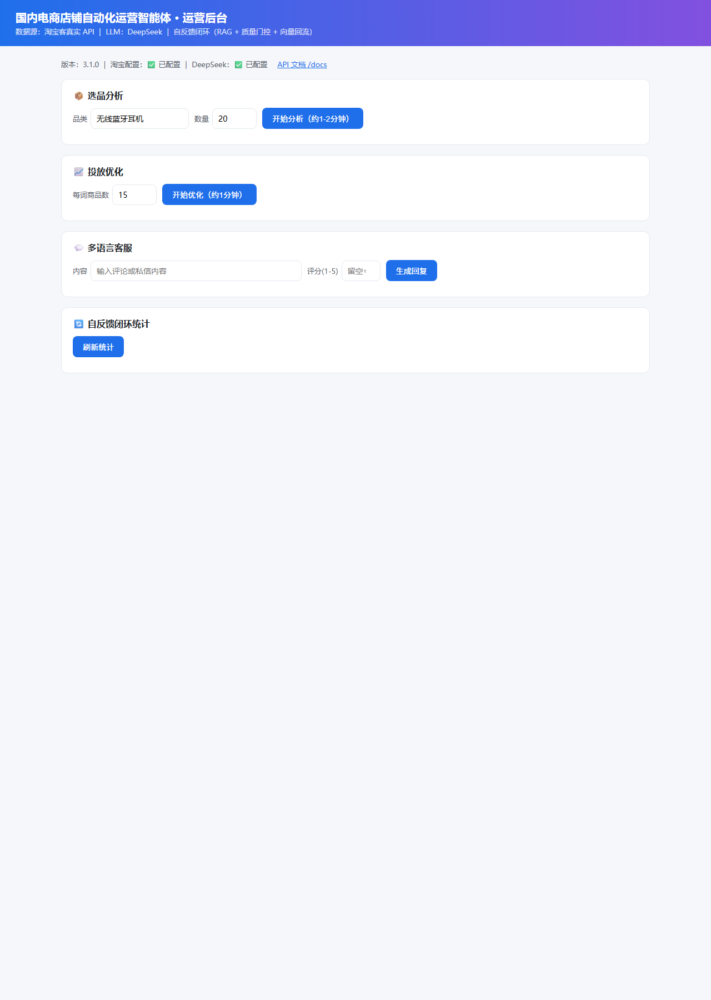
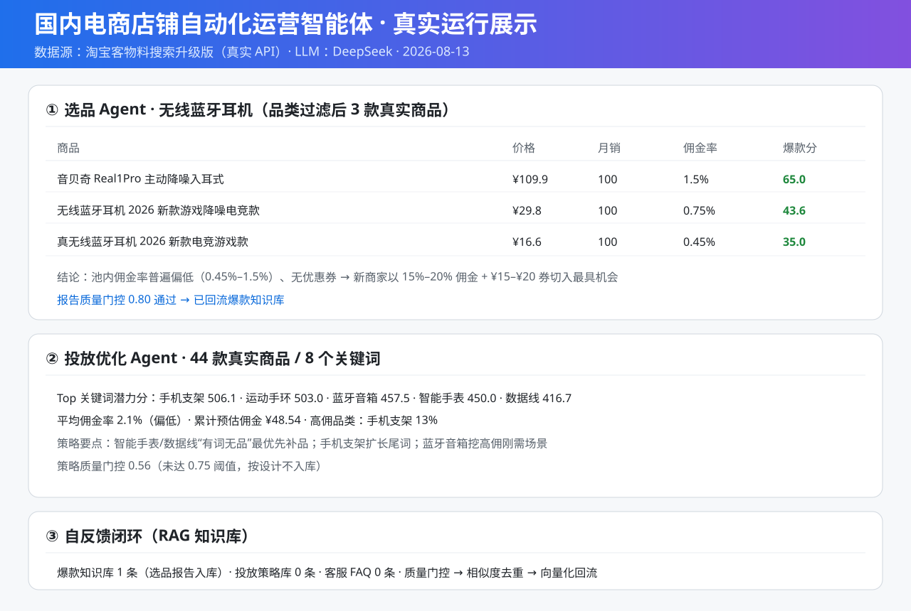

# 国内电商店铺自动化运营智能体（v3.1 真实店铺运营版）

接入**真实淘宝平台（淘宝客 API）** + **DeepSeek 大模型**的电商运营智能体：
选品分析、推广优化、多语言客服、自反馈知识闭环。**配置好密钥即直接用于真实店铺运营**。

    

> 本版仅保留真实店铺运营模式：数据源唯一为淘宝客真实 API，DeepSeek 为必填。
> 未配置密钥或接口失败时明确报错，不生成、不使用任何模拟数据。

## 运行效果（真实数据）



> 真实运行截图：Web 运营后台（选品 / 投放优化 / 多语言客服 / 自反馈闭环），访问 http://127.0.0.1:8000/ 即可使用。

运行数据示意：



> 数据为 2026-08-13 淘宝客真实接口运行结果；重新运行后可更新 `docs/screenshots/run_demo.svg`。

## 核心能力
- **选品 Agent**：基于淘宝客物料搜索的真实商品数据（价格/月销/佣金率/优惠券）→ 爆款指数 → 选品分析报告；
- **投放优化 Agent**：按关键词抓取淘宝联盟推广商品，用「佣金率 × 月销」推广潜力分输出优化方案；
- **多语言客服 Agent**：预置 FAQ 模板锁定业务口径，DeepSeek 结合评论/私信细节个性化回复；
- **自反馈闭环**：质量门控 → 去重 → 向量回流 → 容量控制（可选 RAG，未装依赖自动跳过）；
- **报告落库 + 历史趋势**：选品/投放报告自动写入 SQLite（`data/reports.db`），后台可查历史报告与近 30 天关键指标趋势图；
- **今日运营总览**：打开后台即见今日选品/投放摘要、商品库待办与近 7 天趋势，不用先点按钮等报告；
- **商品库与状态流转**：推荐商品自动沉淀为商品池（分页浏览），支持标记「待投放 / 已投放 / 效果待观察 / 已排除」，让推荐可跟踪、可复盘；
- **每日定时任务**：API 启动后自动调度，每天固定时刻（默认 09:30）自动运行选品+投放分析并落库，实现无人值守日度运营；
- **推广链接落地**：报告内 Top10 商品展示真实淘宝客推广链接（`click_url`），一键复制或生成二维码，推荐可直接投放；
- **钉钉日报推送**：每日报告完成后自动把选品/投放摘要推送到钉钉群（自定义机器人 Webhook，支持加签与自定义关键词 `DINGTALK_KEYWORD`），配置于 `.env` 的 `DINGTALK_WEBHOOK_URL`，后台可一键测试；
- **客服待回复队列**：批量导入差评/私信 → 逐条或一键生成回复 → 标记已回复/忽略，贴近真实客服工作流；
- **页面化设置**：定时任务、选品参数、钉钉开关可直接在后台修改（写回 `.env`，重启生效）；
- **自动投放流水线**：一键执行「选品+投放分析 → 报告/商品落库 → 推广链接清单 → 钉钉推送」，把推荐直接变成可投放动作（合规边界：只生成链接清单，不自动下单/发布）；
- **环节化分页运营台**：后台按「总览 → 选品 → 投放 → 客服 → 沉淀复盘 → 设置」6 个环节分页展示，顶部环节导航 + 上一环节/下一环节切换；自动投放推广链接清单按「选品 / 投放」环节分组并独立分页（每页 5/10/20 可调）。

## 快速开始
```bash
# 1. 安装依赖
pip install -r requirements.txt

# 2. 配置密钥（必填）
copy .env.example .env    # Windows
# cp .env.example .env     # Linux/macOS
# 填写：TAOBAO_APP_KEY / TAOBAO_APP_SECRET / TAOBAO_ADZONE_ID / LLM_API_KEY

# 3. 运行（交互式命令行）
python main.py
# 或 Windows 双击 start.bat

# 4. 运行 API 服务 + Web 运营后台
uvicorn api.app:app --reload
# 浏览器打开 http://127.0.0.1:8000/ 使用运营后台；http://127.0.0.1:8000/docs 查看接口文档
# Windows 一键：start_api.bat 启动 / stop_api.bat 停止
```

## 淘宝接入资质（必做）
1. 注册 [淘宝开放平台](https://open.taobao.com) 开发者，创建**自用型应用**获取 `AppKey / AppSecret`；
2. 开通 [阿里妈妈淘宝联盟](https://pub.alimama.com) 推广位，获取 PID（`mm_站点_广告位_推广`）；
3. `TAOBAO_ADZONE_ID` 填 PID 最后一段数字；
4. 物料搜索使用升级版接口 `taobao.tbk.dg.material.optional.upgrade`，需在淘宝联盟开放平台申请权限包「淘宝客【推广者】商品物料获取」（scope 27939）；免 OAuth、免付费。

> 订单结算接口（`taobao.tbk.order.details.get`）为付费/需商家权限，默认关闭（`TAOBAO_ORDER_ENABLED=false`）。

## 目录结构
```
domestic_ecommerce_agent_taobao/
├── .env.example          # 环境变量模板（必填项标注）
├── requirements.txt      # 依赖清单
├── main.py               # 交互式入口（启动时校验配置）
├── start.bat / start_api.bat
├── config/settings.py    # 全局配置（全部来自 .env，含启动校验）
├── crawlers/
│   ├── taobao_client.py        # 淘宝客 TOP 网关：签名 + 请求 + 解析
│   ├── competitor_crawler.py   # 竞品数据（真实淘宝客数据源）
│   └── ad_data_crawler.py      # 推广数据 + 可选订单
├── agents/
│   ├── base_agent.py           # LLM 基类（DeepSeek 必填）
│   ├── product_selection_agent.py
│   ├── ad_optimization_agent.py
│   └── customer_service_agent.py
├── retrieval/            # 向量库(可选) / 质量门控 / 自反馈闭环
├── storage/              # 报告落库 + 商品库 + 客服队列（SQLite：历史查询 / 趋势 / 商品与客服状态流转）
├── notify/               # 钉钉机器人日报推送（markdown + 可选加签）
├── utils/                # 翻译 / 日志 / 数据处理
├── api/app.py            # FastAPI 服务
├── api/scheduler.py      # 每日定时任务（自动选品+投放并落库）
└── data/templates/reply_templates.json   # 客服预置模板
```


## Windows 部署（本机 D 盘已验证）
```powershell
# 已就绪：D:\domestic_ecommerce_agent_taobao（含 .venv 虚拟环境）
cd D:\domestic_ecommerce_agent_taobao

# 1. 填写密钥（必填，缺失时启动会明确报错）
notepad .env
#   TAOBAO_APP_KEY / TAOBAO_APP_SECRET / TAOBAO_ADZONE_ID / LLM_API_KEY

# 2. 交互式运行（或双击 start.bat）
.\.venv\Scripts\python.exe main.py

# 3. API 服务（或双击 start_api.bat），Swagger 文档: http://127.0.0.1:8000/docs
.\.venv\Scripts\python.exe -m uvicorn api.app:app --reload --port 8000
```
> 本机系统 `python` 为应用商店占位符，请统一使用项目内 `.venv\Scripts\python.exe`。

## API 摘要
- `POST /api/v1/selection/analyze` 选品分析
- `POST /api/v1/ad/optimize` 推广优化
- `POST /api/v1/cs/review` 评论回复
- `POST /api/v1/cs/message` 私信回复
- `POST /api/v1/cs/queue` 客服队列批量导入（每行一条）
- `GET /api/v1/cs/queue?status=` 客服队列列表（含统计）
- `POST /api/v1/cs/queue/{id}/reply` 生成回复
- `PATCH /api/v1/cs/queue/{id}` 更新状态（忽略等）
- `GET /api/v1/loop/stats` 闭环统计
- `GET /api/v1/dashboard/summary` 今日运营总览（今日报告+待办+趋势+知识库）
- `GET /api/v1/products?status=&source=&q=` 商品库列表
- `PATCH /api/v1/products/{id}` 更新商品状态（待投放/已投放/已排除/效果待观察）
- `GET /api/v1/reports?type=selection|ad` 历史报告列表
- `GET /api/v1/reports/{id}` 报告详情（含正文与 Top 商品推广链接）
- `GET /api/v1/reports/trend?type=selection|ad` 趋势聚合
- `POST /api/v1/notify/test` 钉钉推送测试
- `POST /api/v1/auto/launch` 自动投放流水线（分析→落库→链接清单→钉钉）
- `GET /api/v1/settings` 读取运营设置（不含密钥）
- `PUT /api/v1/settings` 保存运营设置（写 `.env`，重启生效）
- `GET /api/v1/system/status` 系统状态（不含密钥）

## 合规与边界
- 代码中不写死任何密钥，全部从 `.env` 读取，启动时校验缺失项；
- 只生成选品结论、推广方案、客服回复文本，**不自动下单、不自动发布**（由运营者确认后执行）；
- 不承诺收益，佣金/ROI 为估算口径，以淘宝联盟实际结算为准；
- 遵守淘宝开放平台与阿里妈妈联盟协议。
