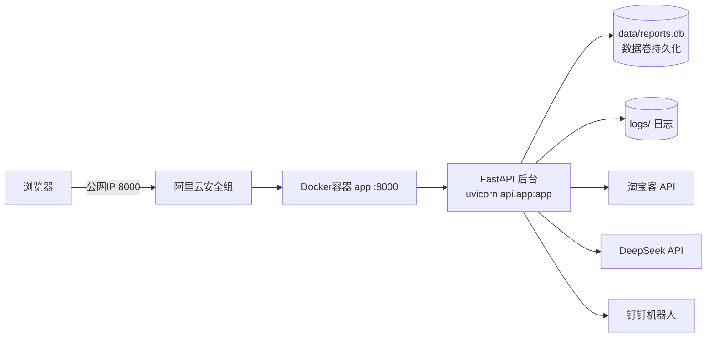

# 阿里云上线指南（Docker 部署）

> 目标：把「国内电商店铺自动化运营智能体」部署到阿里云 ECS，通过公网访问 Web 后台与 API。
> 前置条件：已购买阿里云 ECS（推荐 2 核 2G 起步）、已开通安全组、可 SSH 登录。

## 一、总体架构



- 对外暴露端口：**8000**（Web 后台 `/`、API 文档 `/docs`、健康检查 `/health`）
- 数据与日志通过 Docker 数据卷持久化，容器重建不丢数据
- 密钥（`.env`）只存在于服务器，不打进镜像、不上传 GitHub

## 二、部署流程（全程在服务器上执行）

### 1. 阿里云控制台：放行端口

1. 登录阿里云控制台 → ECS 实例 → 找到你的实例
2. 左侧「安全组」→「配置规则」→「入方向」→「手动添加」
3. 添加规则：协议 TCP、端口范围 **8000/8000**、授权对象 **0.0.0.0/0**（或只放行你的办公网 IP，更安全）
4. 保存

> 提示：后续若配置域名 + HTTPS（443），再把 443 一并放行。

### 2. SSH 登录服务器

Windows 自带的终端可直接：

```powershell
ssh root@<服务器公网IP>
```

按提示输入实例密码（或使用密钥登录）。

### 3. 安装 Docker（阿里云镜像加速）

```bash
# 安装 docker（Alibaba Cloud Linux / CentOS 系）
sudo yum install -y docker
sudo systemctl enable --now docker

# Ubuntu / Debian 系
# sudo apt-get update && sudo apt-get install -y docker.io docker-compose-v2

# 配置阿里云镜像加速（国内拉镜像更快，账号中心获取专属加速地址）
sudo mkdir -p /etc/docker
sudo tee /etc/docker/daemon.json <<'EOF'
{ "registry-mirrors": ["https://<你的加速地址>.mirror.aliyuncs.com"] }
EOF
sudo systemctl restart docker
```

> 加速地址在：阿里云控制台 → 容器镜像服务 ACR → 镜像加速器，页面会给出专属 URL。

### 4. 部署（一键脚本）

```bash
# 克隆并进入项目
git clone --depth 1 https://github.com/lyq050131/domestic-ecommerce-agent.git
cd domestic-ecommerce-agent

# 初始化 .env（从模板复制后编辑）
cp .env.example .env
vi .env
```

`.env` 中必填项（就是你本机已在用的那套密钥）：

| 变量 | 说明 |
| --- | --- |
| `LLM_API_KEY` | DeepSeek API Key |
| `TAOBAO_APP_KEY` / `TAOBAO_APP_SECRET` | 淘宝开放平台 AppKey/AppSecret |
| `TAOBAO_ADZONE_ID` | 阿里妈妈 PID 最后一段数字 |

建议额外设置：

| 变量 | 说明 |
| --- | --- |
| `WEB_ACCESS_TOKEN` | Web 后台登录令牌，设了之后访问 `/` 需登录、API 需 `Bearer` |
| `DINGTALK_WEBHOOK_URL` | 钉钉机器人 Webhook，报告自动推送 |
| `DINGTALK_SECRET` | 机器人加签密钥（若开启加签） |

然后构建并启动：

```bash
docker compose up -d --build
```

### 5. 验证上线

```bash
# 本地健康检查
curl http://127.0.0.1:8000/health
# 期望: {"status":"healthy","version":"3.1.0"}

# 查看实时日志
docker compose logs -f app
```

浏览器访问：

- Web 后台：`http://<服务器公网IP>:8000/`
- API 文档：`http://<服务器公网IP>:8000/docs`

看到「健康检查 healthy」即上线成功。

## 三、日常运维

```bash
# 查看日志
docker compose logs -f app

# 重启
docker compose restart

# 更新到 GitHub 最新代码
git pull
docker compose up -d --build

# 查看运行状态
docker compose ps
docker inspect --format='{{.State.Health.Status}}' domestic-ecommerce-agent
```

数据备份（重要）：`data/` 目录下有 `reports.db` 报告库，建议定期打包：

```bash
cd /opt/domestic-ecommerce-agent 2>/dev/null || cd ~/domestic-ecommerce-agent
tar czf backup_$(date +%F).tar.gz data logs
```

## 四、域名 + HTTPS（可选，推荐）

不配域名也能用 IP 访问。要正式对外建议配域名 + HTTPS：

1. 阿里云控制台购买/解析域名，A 记录指向服务器公网 IP
2. 申请免费证书：数字证书管理服务 → 免费证书 → 创建 → 下载 Nginx 版
3. 在服务器安装 Nginx 反代：

```bash
sudo yum install -y nginx   # Ubuntu: sudo apt-get install -y nginx
```

4. 配置 `/etc/nginx/conf.d/agent.conf`：

```nginx
server {
    listen 80;
    server_name your-domain.com;
    return 301 https://$host$request_uri;
}

server {
    listen 443 ssl;
    server_name your-domain.com;

    ssl_certificate     /etc/nginx/ssl/your-domain.com.pem;
    ssl_certificate_key /etc/nginx/ssl/your-domain.com.key;

    location / {
        proxy_pass http://127.0.0.1:8000;
        proxy_set_header Host $host;
        proxy_set_header X-Real-IP $remote_addr;
        proxy_set_header X-Forwarded-For $proxy_add_x_forwarded_for;
        client_max_body_size 20m;
    }
}
```

5. 安全组放行 80/443，`nginx -t && systemctl restart nginx`
6. 之后访问 `https://your-domain.com/` 即可，钉钉推送里的报告链接也建议把 `notify/dingtalk.py` 中的本地地址换成你的域名

## 五、常见问题

| 现象 | 原因与处理 |
| --- | --- |
| 浏览器访问不通 | 安全组未放行 8000；或服务器防火墙（`sudo firewall-cmd --permanent --add-port=8000/tcp && sudo firewall-cmd --reload`） |
| 容器反复重启 | `docker compose logs app` 看报错，多为 `.env` 必填项缺失 |
| 拉取镜像很慢 | 未配置阿里云镜像加速，见上文第 3 步 |
| 每天 09:30 自动跑报告 | `AUTO_REPORT_ENABLED=true` 时容器内定时器自动触发，报告写入 `data/reports.db` 并推钉钉 |
| 端口被占用 | 改 `docker-compose.yml` 的 `8000:8000` 为 `你想要的端口:8000`，再 `docker compose up -d` |

## 六、CentOS 7 实测要点（2026-08 上线实录）

- 阿里云新实例 CentOS 7 默认**已预装 Docker CE 26.1.4 + Compose v2.27.1**，无需手动安装；但系统**未装 git**，需先 `yum install -y git`；
- CentOS 7 的 `yum install -y docker` 装的是旧版 Docker 1.13，不要用；确认版本用 `docker --version`；
- 阿里云 CentOS 7 默认 firewalld/iptables 均未启用，服务器本机不拦截端口；公网不通时优先检查**安全组**；
- 国内服务器构建镜像建议 `export PIP_INDEX_URL=https://pypi.tuna.tsinghua.edu.cn/simple` 再 `docker compose up -d --build`（Dockerfile 已支持该构建参数）；
- 镜像内未安装 chromadb/sentence-transformers，启动日志提示「降级为无 RAG 模式」属正常，不影响业务。

## 六、安全提醒

- `.env` 含真实密钥，**永远不要提交到 GitHub**（本项目已在 `.gitignore` 排除）
- `WEB_ACCESS_TOKEN` 强烈建议设置，否则任何人可访问后台触发真实淘宝 API 调用
- 如长期暴露公网，建议：只放行办公网 IP 访问 8000；或用 Nginx + HTTPS + 登录令牌双保险
- 淘宝/DeepSeek API 有调用配额与费用，上线后注意监控用量
